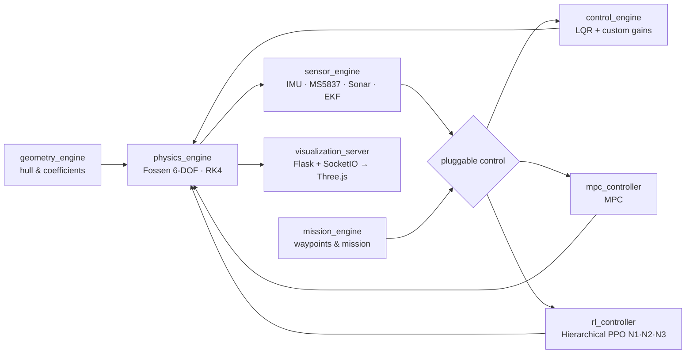

<div align="center">

# USV Digital Twin
### A Virtual Test Bench for Autonomous Marine Vehicles

[]()
[]()
[](LICENSE)
[%20%E2%89%A4%200.8%25%20RMS-gold)](docs/VALIDATION.md)

**A high-fidelity digital twin to design, simulate and validate autonomous surface vehicles (USV) — before any sea trial.**

[Versão em português](README.md) · [Architecture](docs/ARCHITECTURE.md) · [Validation](docs/VALIDATION.md) · [Contributing](CONTRIBUTING.md)

</div>

---

## Overview

Testing autonomous control systems at sea is expensive, slow and risky — and most high-fidelity simulation alternatives are foreign, closed-source products. This project attacks that bottleneck with a **modular, fully open virtual test bench** where a complete design iteration (define vehicle → configure scenario → simulate mission → analyze → repeat) costs minutes instead of a sea campaign.

The environment integrates 6-DOF marine dynamics, statistical sensor fusion, pluggable control (classical and learning-based) and real-time 3D visualization — all as independent modules that can be swapped without rewriting the system.

## Validation

The physics engine was verified by **cross-validation against the international reference Otter USV model** (Fossen). Experiment: 15 N lateral impulse for 5 s, followed by 60 s of free drift, executed identically on both implementations.

| State variable | RMS error | Normalized |
| --- | --- | --- |
| Position x | 0.0011 m | 0.0 % |
| Position y | 0.0008 m | 0.2 % |
| Surge velocity (u) | 0.0007 m/s | 0.8 % |
| Sway velocity (v) | 0.0001 m/s | 0.1 % |
| Yaw rate (r) | 0.00004 rad/s | 0.4 % |

**Result: consistent with the reference — maximum deviation ≤ 0.8 %.** Full protocol in [`docs/VALIDATION.md`](docs/VALIDATION.md).

> Scope note: this is *numerical verification* (model vs. reference model). Validation against real instrumentation data (towing tank) is the next phase of the roadmap.

## Architecture



| Module | Role |
| --- | --- |
| `physics_engine.py` | 6-DOF rigid-body dynamics (Fossen, 2011): added mass, Coriolis, quadratic drag, restoring forces. RK4 integration at 0.01 s time step (100 Hz). |
| `geometry_engine.py` | Hull geometry (Von Kármán ogive) and hydrodynamic coefficient computation. |
| `sensor_engine.py` | Emulation of real hardware (IMU, MS5837 barometer, Open Echo sonar) with injectable noise, plus Extended Kalman Filter (EKF) fusion. |
| `control_engine.py` | Classical controllers: LQR and custom gain logic for nonlinear dynamics. Serves as performance baseline and deterministic fallback. |
| `mpc_controller.py` | Model Predictive Control (MPC). |
| `rl_controller.py` | In-house PPO agent in a hierarchical architecture: **N1** attitude/depth stabilization, **N2** sonar-based obstacle avoidance, **N3** waypoint navigation. |
| `mission_engine.py` | Mission definition and execution (waypoints, scenario). |
| `train_rl_pipeline.py` | Agent training pipeline with Domain Randomization (water density, sensor noise, disturbances). Produces `rl_training_report.json`. |
| `visualization_server.py` | Flask + SocketIO bridge for real-time 3D visualization (Three.js) in the browser. |

## Installation

Requires Python 3.10+.

```bash
git clone https://github.com/duds063/Unmanned_Submersive_Vehicle.git
cd Unmanned_Submersive_Vehicle
pip install -r requirements.txt
```

## Quick start

```bash
# 1. Physics and control module validation tests
python physics_engine.py
python control_engine.py

# 2. RL agent training (produces rl_training_report.json)
python train_rl_pipeline.py

# 3. Real-time 3D visualization (open the printed address in a browser)
python visualization_server.py
```

Reference training parameters (see `rl_training_report.json`): 10 cycles, 4,096 steps per phase, `dt = 0.01 s`, three agents (N1/N2/N3).

## Roadmap

- [x] **Phase 1 — Operational environment.** Physics, sensors, estimation, control and visualization integrated end-to-end; physics engine validated against the Otter USV.
- [ ] **Phase 2 — Real calibration.** Towing-tank trials and module tuning against measured instrumentation data.
- [ ] **Phase 3 — Platform adoption.** Use of the environment in the development of real vehicles.

## Partnerships

The project collaborates with university autonomous-vehicle teams in three countries:

| Team | Institution | Country |
| --- | --- | --- |
| AllBlue Technologies | University of Brasília (UnB) | Brazil |
| ITU AUV | Istanbul Technical University (İTÜ) | Turkey |
| VantTech | Tecnológico de Monterrey | Mexico |

## Methodology & lineage

The project evolves from a research line started with the **ICS (Inertial Control Sandbox)**, focused on the transition from simple inertial systems to full marine dynamics. Domain Randomization during training targets policies resilient to water-density variation and electromagnetic noise — a prerequisite for Sim-to-Real transfer with minimal performance loss.

Main reference: T. I. Fossen, *Handbook of Marine Craft Hydrodynamics and Motion Control*, Wiley, 2011.

## How to cite

```bibtex
@software{usv_digital_twin,
  author  = {Souza Costa, Eduardo and Valdiero Medeiros, Marcelo Henrique},
  title   = {USV Digital Twin: A Virtual Test Bench for Autonomous Marine Vehicles},
  year    = {2026},
  url     = {https://github.com/duds063/Unmanned_Submersive_Vehicle}
}
```

## License & authors

This project uses a **dual licensing model**:

- **Noncommercial use — free.** The code is available under the
  [PolyForm Noncommercial License 1.0.0](LICENSE): research, education, personal study,
  nonprofit projects and **government institutions** may use, modify and distribute it freely.
- **Commercial use — negotiated license.** Companies wishing to incorporate the software
  into for-profit products or services must obtain a commercial license from the copyright
  holders — see [`COMMERCIAL-LICENSE.md`](COMMERCIAL-LICENSE.md).

> **Note:** earlier versions published under a different license remain governed by the terms in force at the time of their distribution. From this version onward, PolyForm Noncommercial 1.0.0 applies.

Developed by **Eduardo Souza Costa**.
Contributions are welcome — see [`CONTRIBUTING.md`](CONTRIBUTING.md).
