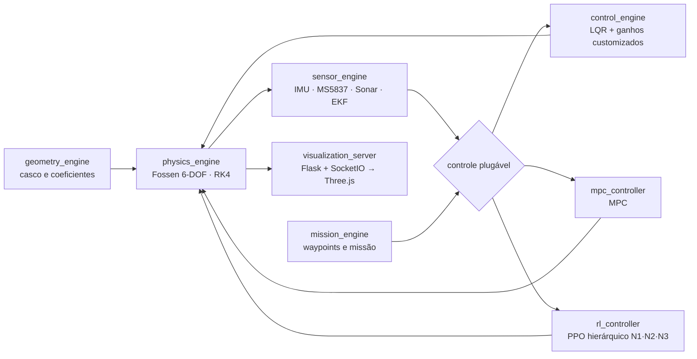

<div align="center">

# USV Digital Twin
### Banco de Provas Virtual para Veículos Marinhos Autônomos

[]()
[]()
[](LICENSE)
[%20%E2%89%A4%200.8%25%20RMS-gold)](docs/VALIDATION.md)

**Gêmeo digital de alta fidelidade para projetar, simular e validar veículos autônomos de superfície (USV) — antes de qualquer campanha de mar.**

[English version](README.en.md) · [Arquitetura](docs/ARCHITECTURE.md) · [Validação](docs/VALIDATION.md) · [Contribuindo](CONTRIBUTING.md)

</div>

---

## Visão geral

Testar sistemas de controle autônomo no mar real é caro, lento e arriscado — e as alternativas de simulação de alta fidelidade são, em geral, estrangeiras e de código fechado. Este projeto ataca esse gargalo com um **banco de provas virtual, modular e de código 100% nacional**, onde uma iteração completa de projeto (definir veículo → configurar cenário → simular missão → analisar → repetir) custa minutos, não uma campanha de mar.

O ambiente integra física naval de 6 graus de liberdade, fusão estatística de sensores, controle plugável (clássico e por aprendizado) e visualização 3D em tempo real — tudo em módulos independentes que podem ser trocados sem reescrever o sistema.

## Validação

O motor de física foi verificado por **validação cruzada contra o modelo de referência internacional Otter USV** (Fossen). Experimento: impulso lateral de 15 N por 5 s, seguido de deriva livre por 60 s, executado identicamente nas duas implementações.

| Variável de estado | Erro RMS | Normalizado |
| --- | --- | --- |
| Posição x | 0,0011 m | 0,0 % |
| Posição y | 0,0008 m | 0,2 % |
| Velocidade surge (u) | 0,0007 m/s | 0,8 % |
| Velocidade sway (v) | 0,0001 m/s | 0,1 % |
| Taxa de guinada (r) | 0,00004 rad/s | 0,4 % |

**Resultado: consistente com a referência — desvio máximo ≤ 0,8 %.** Detalhes do protocolo em [`docs/VALIDATION.md`](docs/VALIDATION.md).

> Nota de escopo: trata-se de *verificação numérica* (modelo contra modelo de referência). A validação contra dados de instrumentação real (tanque de provas) é a próxima fase do roadmap.

## Arquitetura



| Módulo | Papel |
| --- | --- |
| `physics_engine.py` | Dinâmica de corpo rígido 6-DOF (Fossen, 2011): massa adicionada, Coriolis, arrasto quadrático, restauração. Integração por Runge-Kutta de 4ª ordem, passo de 0,01 s (100 Hz). |
| `geometry_engine.py` | Geometria de casco (ogiva de Von Kármán) e cálculo de coeficientes hidrodinâmicos. |
| `sensor_engine.py` | Emulação de hardware real (IMU, barômetro MS5837, sonar Open Echo) com ruído injetável, e fusão por Filtro de Kalman Estendido (EKF). |
| `control_engine.py` | Controladores clássicos: LQR e lógica de ganhos customizada para dinâmicas não lineares. Serve de referência de desempenho e *fallback* determinístico. |
| `mpc_controller.py` | Controle preditivo por modelo (MPC). |
| `rl_controller.py` | Agente PPO de implementação própria, em arquitetura hierárquica: **N1** estabilização de atitude/profundidade, **N2** evasão de obstáculos via sonar, **N3** navegação por waypoints. |
| `mission_engine.py` | Definição e execução de missões (waypoints, cenário). |
| `train_rl_pipeline.py` | Pipeline de treinamento dos agentes com *Domain Randomization* (densidade da água, ruído sensorial, perturbações). Gera `rl_training_report.json`. |
| `visualization_server.py` | Ponte Flask + SocketIO para visualização 3D em tempo real (Three.js) no navegador. |

Descrição detalhada de cada módulo e das interfaces entre eles: [`docs/ARCHITECTURE.md`](docs/ARCHITECTURE.md).

## Instalação

Requisitos: Python 3.10+.

```bash
git clone https://github.com/duds063/Unmanned_Submersive_Vehicle.git
cd Unmanned_Submersive_Vehicle
pip install -r requirements.txt
```

## Uso rápido

```bash
# 1. Testes de validação dos módulos de física e controle
python physics_engine.py
python control_engine.py

# 2. Treinamento dos agentes de RL (gera rl_training_report.json)
python train_rl_pipeline.py

# 3. Visualização 3D em tempo real (abra o endereço indicado no navegador)
python visualization_server.py
```

Parâmetros de treinamento de referência (ver `rl_training_report.json`): 10 ciclos, 4.096 passos por fase, `dt = 0,01 s`, três agentes (N1/N2/N3).

## Roadmap

- [x] **Fase 1 — Ambiente operacional.** Física, sensores, estimação, controle e visualização integrados de ponta a ponta; motor de física validado contra o Otter USV.
- [ ] **Fase 2 — Calibração real.** Ensaios em tanque de provas e ajuste dos módulos a dados de instrumentação medidos.
- [ ] **Fase 3 — Adoção como plataforma.** Uso do ambiente no desenvolvimento de veículos reais.

## Parcerias

O projeto colabora com equipes universitárias de veículos autônomos em três países:

| Equipe | Instituição | País |
| --- | --- | --- |
| AllBlue Technologies | Universidade de Brasília (UnB) | Brasil |
| ITU AUV | Istanbul Technical University (İTÜ) | Turquia |
| VantTech | Tecnológico de Monterrey | México |

## Metodologia e linhagem

O projeto evolui de uma esteira de pesquisa iniciada no **ICS (Inertial Control Sandbox)**, com foco na transição de sistemas inerciais simples para dinâmicas navais completas. O uso de *Domain Randomization* durante o treinamento visa políticas resilientes a variações de densidade da água e ruído eletromagnético — pré-requisito para transferência Sim-to-Real com mínima perda de desempenho.

Referência principal: T. I. Fossen, *Handbook of Marine Craft Hydrodynamics and Motion Control*, Wiley, 2011.

## Como citar

Se este projeto for útil à sua pesquisa, cite-o (ver [`CITATION.cff`](CITATION.cff)):

```bibtex
@software{usv_digital_twin,
  author  = {Souza Costa, Eduardo and Valdiero Medeiros, Marcelo Henrique},
  title   = {USV Digital Twin: Banco de Provas Virtual para Veículos Marinhos Autônomos},
  year    = {2026},
  url     = {https://github.com/duds063/Unmanned_Submersive_Vehicle}
}
```

## Licença e autores

Este projeto adota um **modelo de licenciamento duplo**:

- **Uso não comercial — livre.** O código é disponibilizado sob a
  [PolyForm Noncommercial License 1.0.0](LICENSE): pesquisa, ensino, estudo pessoal,
  projetos sem fins lucrativos e **instituições governamentais** podem usar, modificar
  e distribuir livremente.
- **Uso comercial — sob licença negociada.** Empresas que desejem incorporar o software
  em produtos ou serviços com fins lucrativos devem obter uma licença comercial junto
  aos titulares — veja [`COMMERCIAL-LICENSE.md`](COMMERCIAL-LICENSE.md).

> **Nota:** versões anteriores publicadas sob outra licença permanecem regidas pelos termos vigentes à época da respectiva distribuição. A partir desta versão, aplica-se a PolyForm Noncommercial 1.0.0.
Desenvolvido por **Eduardo Souza Costa**.
Contribuições são bem-vindas — veja [`CONTRIBUTING.md`](CONTRIBUTING.md).
